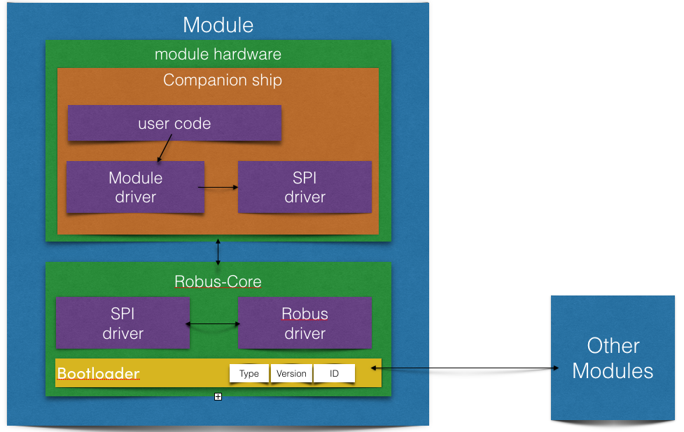
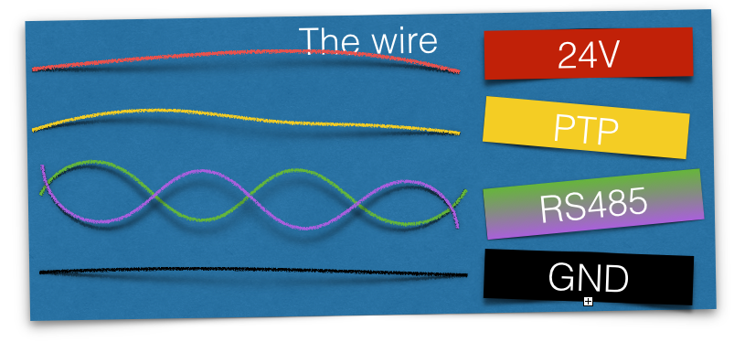

## The hardware side

Each module have the same kind of hardware structure based on 2 main parts, the Robus-Core and the module specific hardware.

### The Robus-Core

Robus-Core is a small solderable board used as bridge between the Robus network and an SPI interface. You can use it as a component on your setup.

- The Robus-Core board contain all the needed hardware to control and manage Robus protocol, you will need to add 2 Robus connectors and link your microcontroler using the SPI programming interface.
- The Bootloader (in yellow) allow the Robus-Core to update the Robus communication firmware (in purple).
- The Robus-Core can save some Module specific information such as module type, protocol revision, ID, and alias.
- In run mode (in no bootloader mode) the Robus-Core can flash and communicate with a companion ship.

 ### The module hardware

The module hardware contain all the specific hardware to manage your devices (sensors, effectors, interfaces, batteries...)

- To have the best flexibility Robus try to reduce the module specific hardware part needs. The only prerequisite is to have an SPI flashable microcontrôler (nativ or using a bootloader).
- You will have to run a small SPI driver to manage run mode message between you program (the module driver) and the Robus-Core.

 ### Why this separation

 This separation allow you to create your own hardware setup as you need.
 Robus can be used by beginers user, so we separate it to prevent bus stuck due to a user code crash. If a module crash you can retart it by command without unpowerring the entire system.

 ### The wire

 The Robus link contain 5 wires :

- Each module can manage 24v at 7A.
- The PTP link is only connected to the next module, this wire is used to neighbour module detection. In the future this link could be used to neighbours communication way.
- The RS485 twisted pair are differential signal allowing high speed and high reliability communication, this twisted pair are shared by each modules

### The connector interface
We have to found one...
