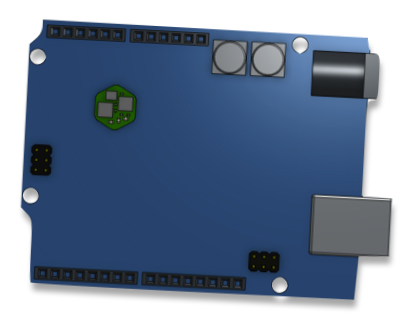

## Specific modules
Before starting to explain what is a specific module, we should know what is a normal module. A normal module follow all the rules defined on the [hardware chartper](01_hardware.md) and the [protocol chapter](02_protocol.md).

### The dev module
The dev module allow the user to create his own module. This board is arduino compatible and it don't have any module driver. You will have to write your own.

### The HUB module
The hub allow you to plug modules in parallel. This module have a specific Robus-core hardware and no module driver because he don't manage any device such as effector or sensor.

### Gates module
Gate modules are modules capable to link the user to the Robus network. This kind of module can receive user directives and act in concequencies on the network. For example Wifi, Bluetooth, USB, or SD card modules are Gate modules, you can gave it commands and it can give you back some numerics data.
This modules allow to switch the Robus network in "verbose" mode avoiding possible "localhost" massaging optimisation to debugging.
They can interract with the bootloader of each module to update the Robus-core firmware.
This modules type is needed to initiate the auto-detection and auto addressing procedure.
They can send a new module firmware to modules on the robot.
