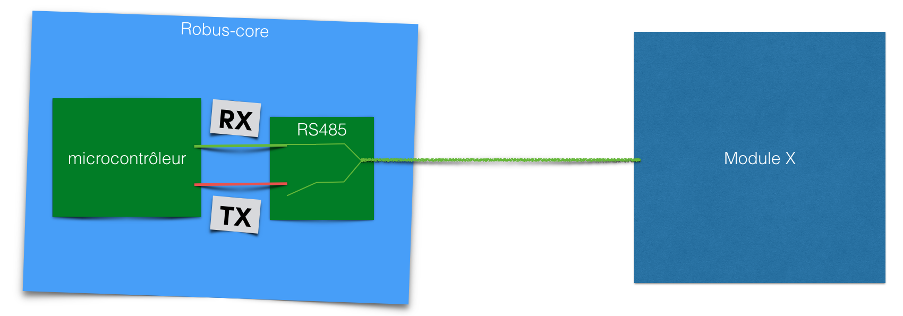
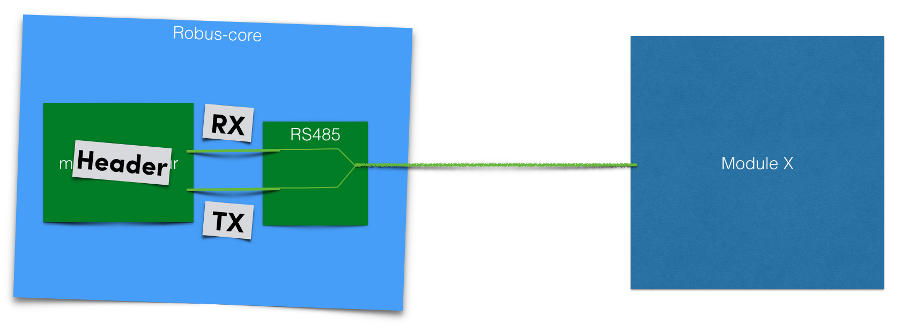
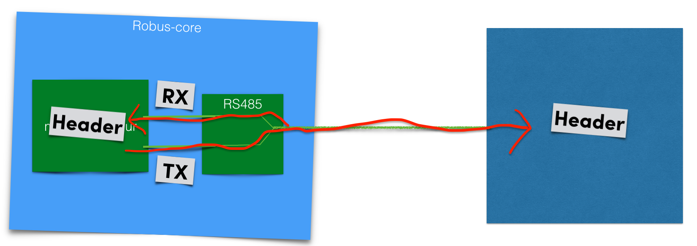
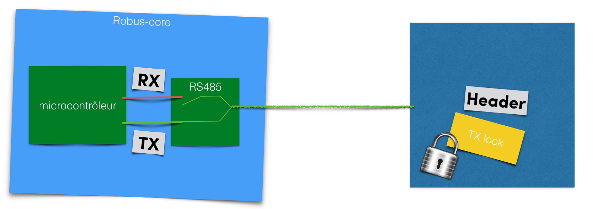
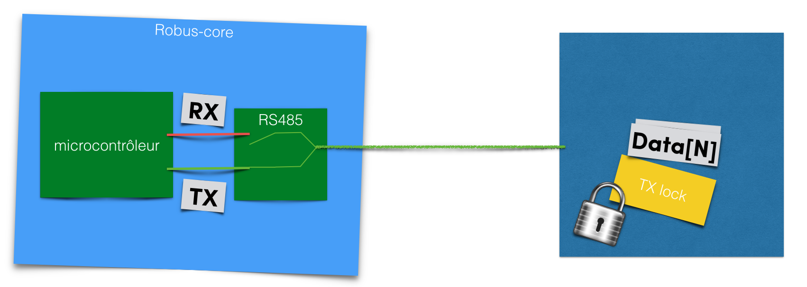
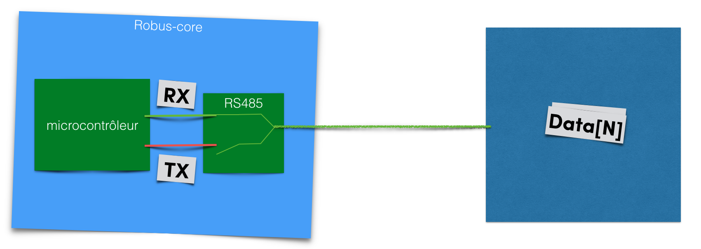

## Multimaster
If we want allowing any module to control any other module we have to manage a Multimaster bus. A Multimaster bus have to manage data collision on the network (if 2 or more modules want to speak at the same time). On our case we have to manage RS485 bus to allowing collision detection.

1. The Robus-core board have a processor and a RS485 driver, during idle time the module keep the driver on reception mode to prevent any incomming messages.

2. When the module want to send something it keep the reception enable and enable transmition mode

3. This way, when the header is sent Robus-core can read back it's transmission and check the message integrity. If another module send something on the same time the Robus core should see somes errors on it's transmitted header, a collision is detected!

4. If the Header transmition is ok (no collision detected) others module should read the header correctly and lock their transmission during the end of the message. The transmiter module can disable the reception on the RS485 driver.

5. The end of the message is sent

6. After the end of the message Robus-core disable transmission mode and enable reception to prevent a ACK reception or another message from another module.
