## Detection management
Thank's to the detection management Robus is able to auto-address modules by using wiring topology of the robot.

### Detection mode
Detection mode is a robus state allowing a topological network discovering and addressing. This state is started by the user using a gate module when he want to remap the module address of his robot.
Take a network example for this one :

1. In this network we have normal modules, a hub with 3 parallel output, and a gate connected to the user. modules are not discovered and they don't have any ID.
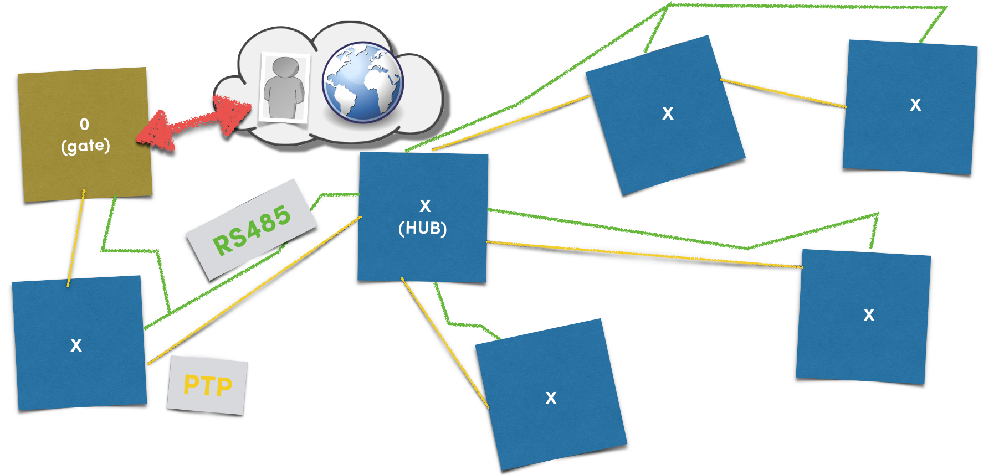

2. The user ask to start the detection process. The gate module create the first address and detect his neigbour (represented by the [1] case)
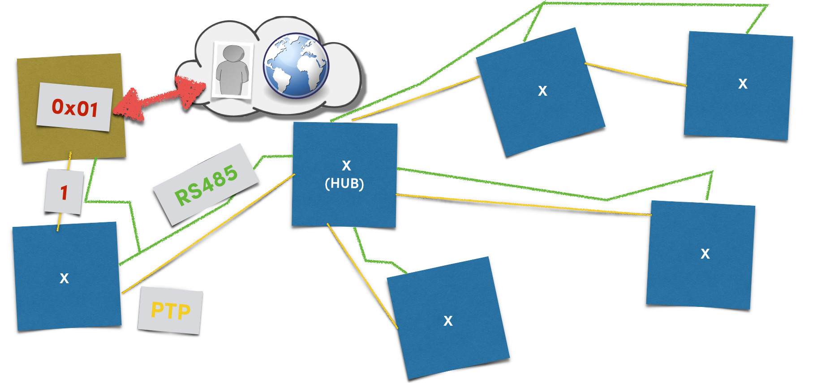

3. The next module is detected so the Gate module send the address and the new discovered module have it's ID.
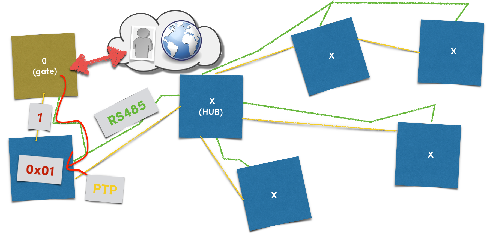

4. After the record of it's new ID the module 1 (the first module) detect a neigbour and the Gate module send a new address to the HUB module.
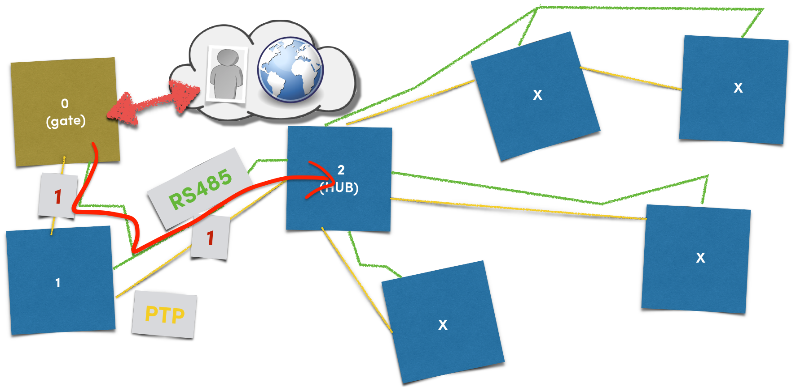

5. The hub continue the discovering process by detecting it's first occuped branch and the chained modules (3 and 4) on this branch get addresses following the same process described for the first module.
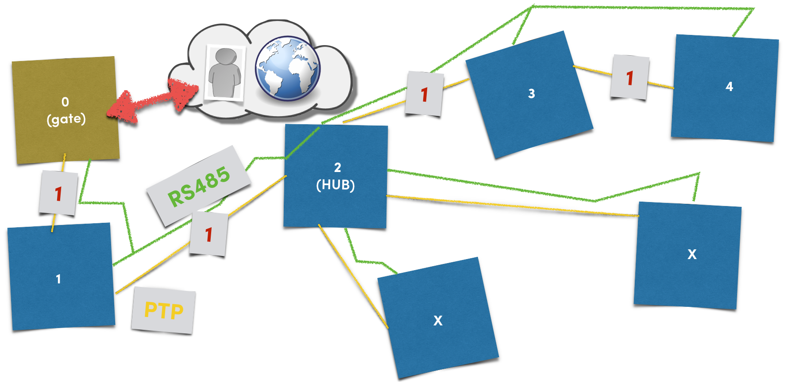

6. The module 4 don't have anybody after so he don't detect anything.
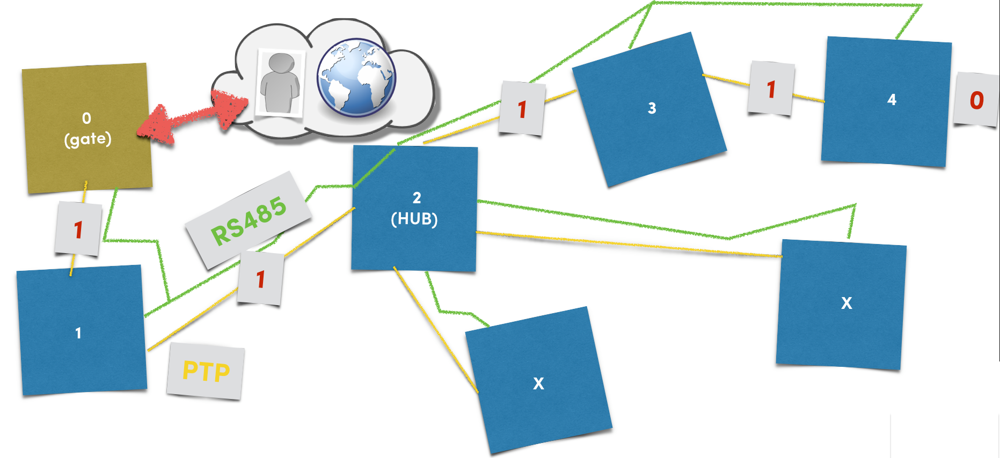

7. Without detection the module 4 end this chain by sending back 0 to previous modules until the hub who catch the end of chain and start detection to the next branch.
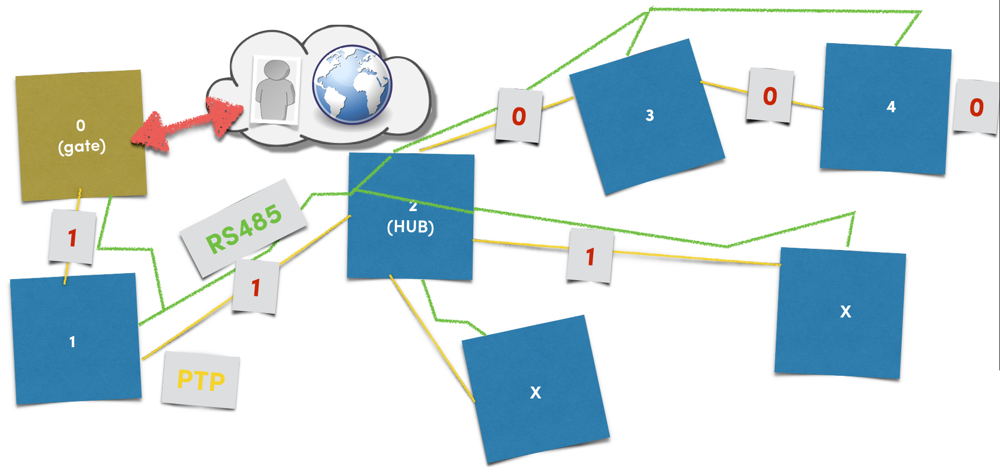

8. Following the same process all module will have an unic ID and the HUB will have end of chain state on all it's branches.

9. The hub explore all it's branches so he send back a 0 to previous modules until the starter gate module. All the network is ok and ready to Rocks...
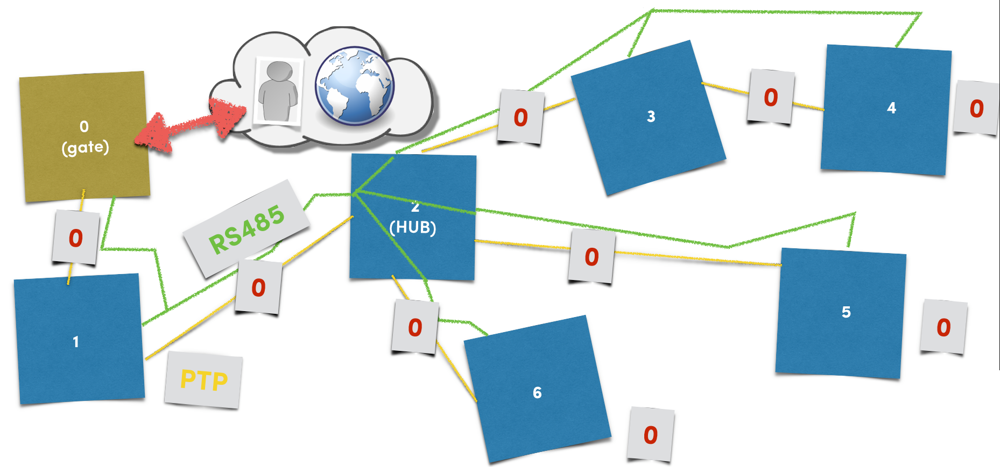

### Neigbour detection
We understand how the detection mode work but not how the system detect their neigbour modules. I will continue describing the process using examples.

1. Take a part of a network, the A module already have an address (it can be a gate, a hub or another module). By default all PTP connection are in reception mode. The A module mission is to detect a neigbour. The X module don't have any ID and waiting something on it's PTP line.
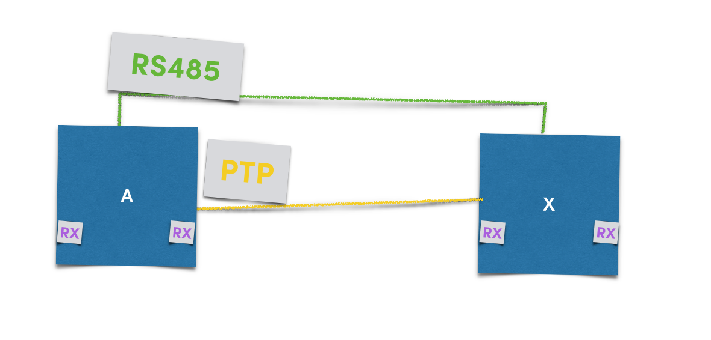

2. The A module start the process by switch it's PTP line to transmition mode and send a 1 value
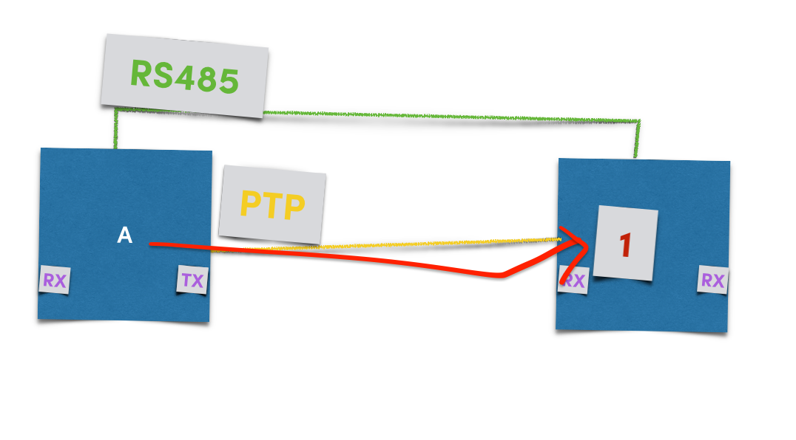

3. After that the A module return the PTP port to reception mode and wait un small time a reply. In this case X module has receved the token, switch it's PTP port to transmission mode and keep the PTP line to 1. If no module send back the token send by A module we have a end of chain state.
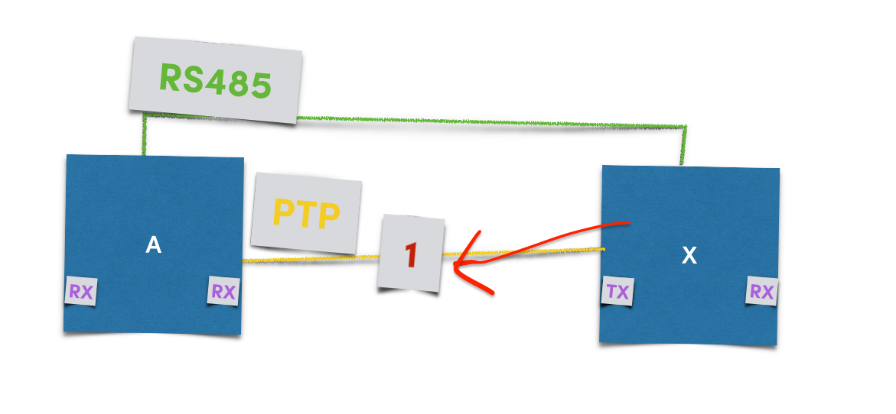

4. The A module detect someone and a new ID (?? here) can be given to X module.
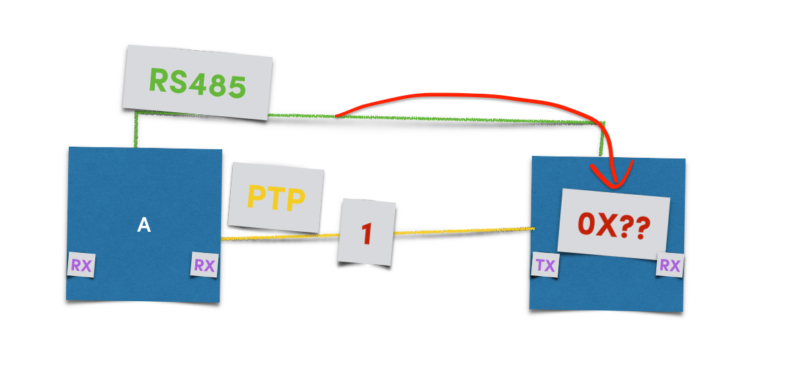

5. After recording it's new ID the module try to continue the process by sending a new token to the next module.
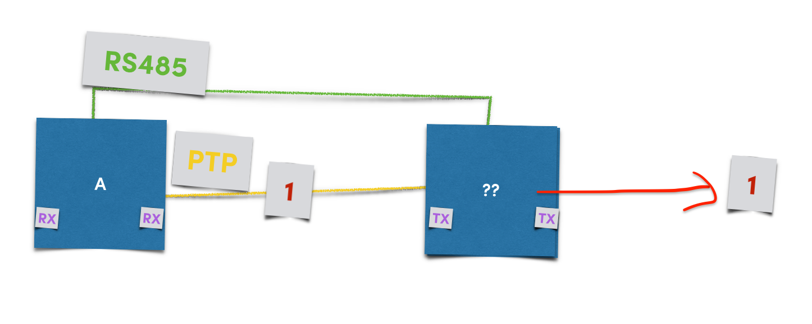

6. But nobody reply after a lapse of time and the last module catch a end of chain.
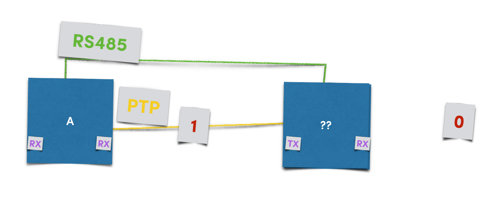

7. So it return back the end of chain state to it's PTP port. After that if the A module is a Gate or a HUB module he will try to follow the same process ont it's other branches.
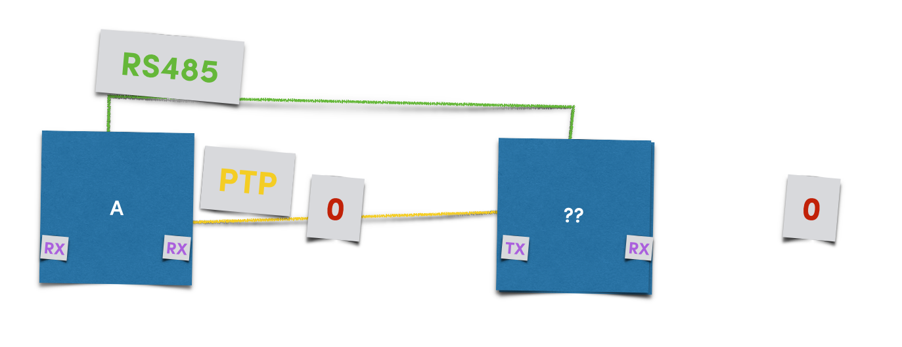
